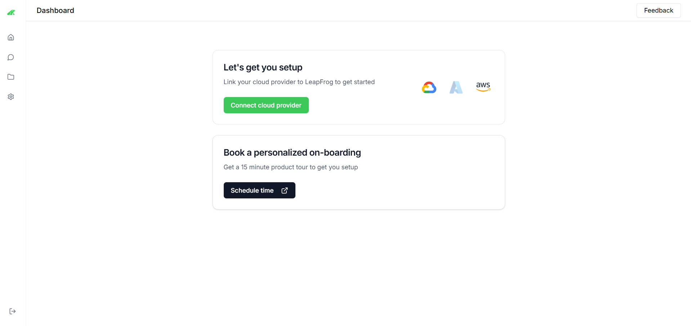
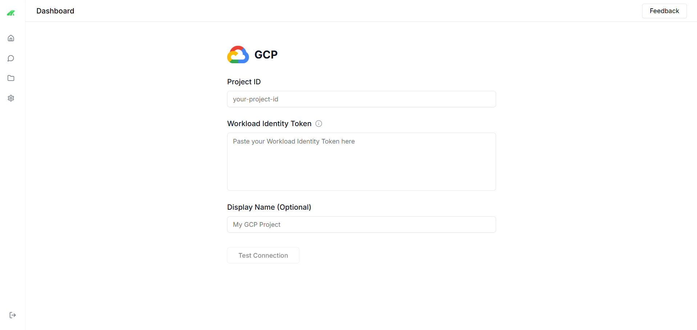
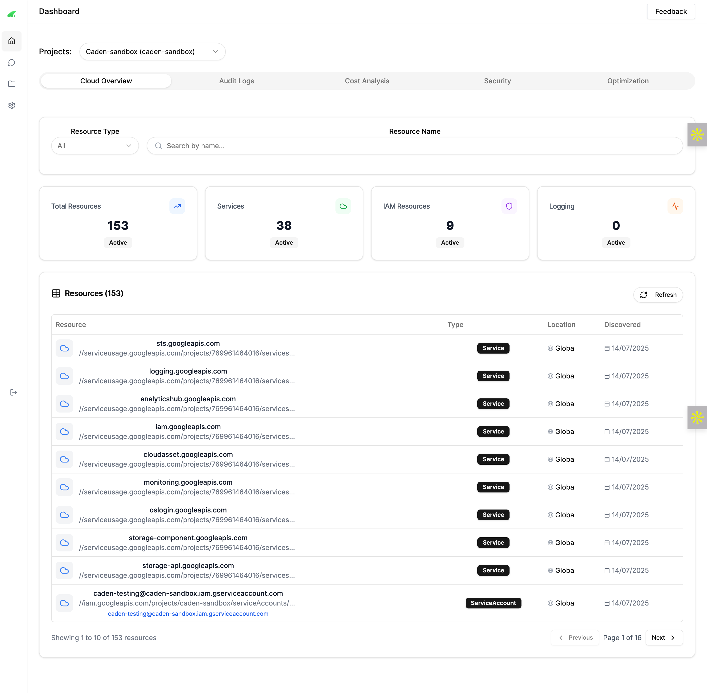
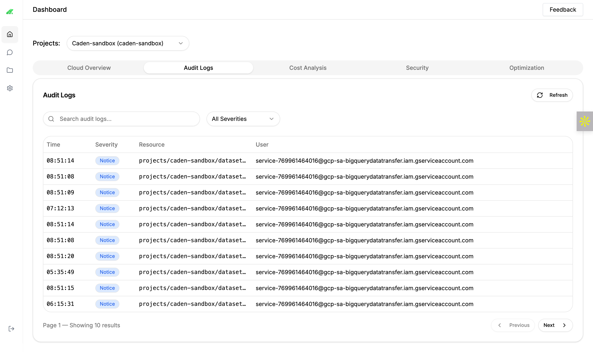
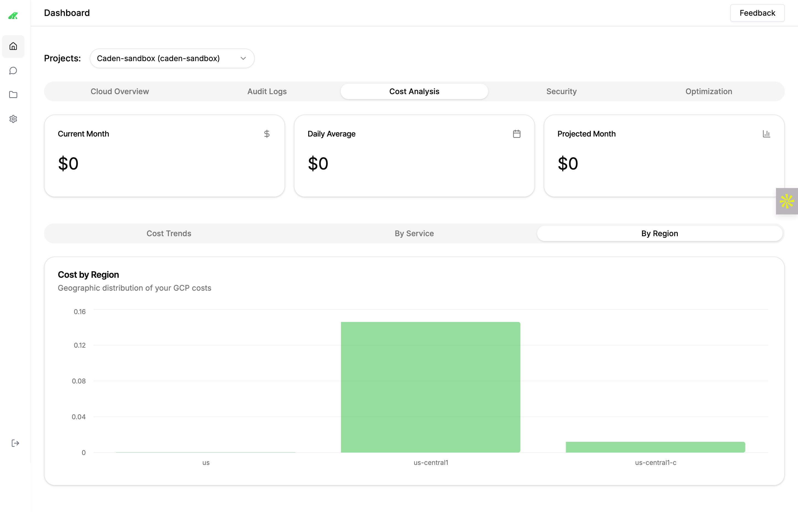
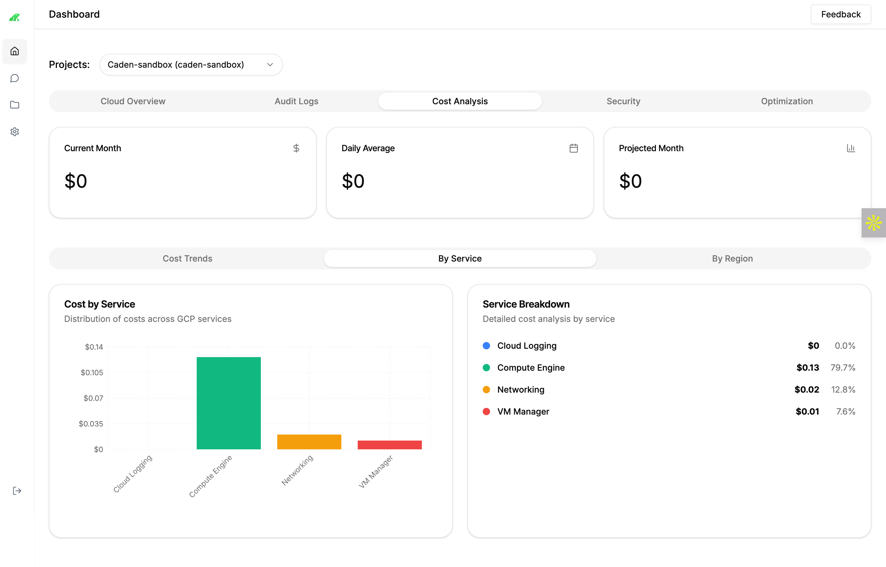
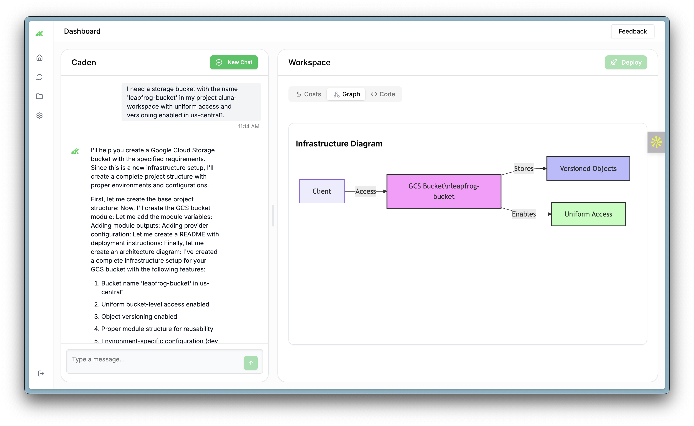

# LeapFrog Labs Onboarding Guide

Welcome to LeapFrog Labs! This guide will help you connect your cloud provider, get started with the platform, and complete the onboarding process to unlock the full potential of [LeapFrog Labs](https://app.leapfrog.cloud).

## Overview

LeapFrog Labs is a platform designed to streamline your cloud-based workflows. To get started, connect your preferred cloud provider (currently supporting Google Cloud Platform) and schedule a personalized onboarding session for a tailored setup experience.

<Callout type="info">
Support for Amazon Web Services and Microsoft Azure is coming soon!
</Callout>

## Getting Started

### Step 1: Connect Your Cloud Provider

Link your cloud provider to LeapFrog Labs to enable seamless integration and access to your resources.

<Tabs>
  <Tab title="Access the Dashboard">
    Log in to [app.leapfrog.cloud](https://app.leapfrog.cloud) and navigate to the **Dashboard**.
  </Tab>
  <Tab title="Connect a Provider">
    On the Dashboard, locate the "Connect your cloud provider" section.
    
    Click **Connect** under **Google Cloud Platform** to begin the setup.
  </Tab>
  <Tab title="Configure Google Cloud Platform">
    - Enter your **Project ID**.
    - Paste your **Workload Identity Token** (refer to our [Identity Token Federation documentation](/identity-token-federation)).
    - Optionally, add a **Display Name** (e.g., "My GCP Project").
    - Click **Test Connection** to verify the setup.
    
  </Tab>
  <Tab title="Confirmation">
    Once connected, the Dashboard will reflect the active cloud provider, allowing you to proceed to the next step.
  </Tab>
</Tabs>

## Onboarding Users

### Initial Setup

- **New Users**: Upon first login, users are directed to the Dashboard with the "Let’s get you setup" prompt.
- **Admin Assistance**: Assign an admin to guide users through cloud provider connection and onboarding scheduling.

<Card title="Schedule Your Onboarding Session" href="mailto:support@leapfrog.cloud">
Contact support to book a personalized onboarding session and maximize your platform experience.
</Card>

## Getting to Know Your Cloud Resources

Explore and manage your cloud resources effectively.

- **View Total Resources**: Check the total number of resources (e.g., 153 active) on the **Cloud Overview** tab.
- **Filter by Type**: Use the **Resource Type** dropdown to filter by Services, IAM Resources, or Logging.
- **Search Resources**: Enter a resource name in the search bar to locate specific items.
- **Details**: Click a resource to view its type, location, and discovery date.

<Callout type="tip">
Click on individual resources to explore detailed insights and configurations.
</Callout>

## Audit Logs

Monitor activities and troubleshoot issues.

- Navigate to the **Audit Logs** tab.
- View logs by time, severity, resource, and user (e.g., notice-level logs for `caden-sandbox`).
- Use the **Refresh** button to update logs in real-time.
- Search logs with the search bar to filter by specific events or resources.

## Cost Analysis

Track and optimize your cloud spending.

<Tabs>
  <Tab title="Current Month">
    View total costs for the current month (e.g., $0).
  </Tab>
  <Tab title="Daily Average">
    See the average daily spend (e.g., $0).
  </Tab>
  <Tab title="Projected Month">
    Estimate future costs based on current usage (e.g., $0).
  </Tab>
</Tabs>

- **Cost Trends**: Analyze cost distribution over time.
- **By Service**: Breakdown costs by service (e.g., Compute Engine at $0.13).
- **By Region**: View geographic cost distribution (e.g., us-central1).

## Chat with Caden

Interact with Caden for assistance and automation.

- Access the chat interface on the left sidebar.
- Type commands like “Create a storage bucket” to build resources.
- Caden provides step-by-step guidance and diagrams.
- Use the **New Chat** button to start fresh conversations.

## Building Resources with Caden

Create and manage resources using Caden’s AI capabilities.

<Tabs>
  <Tab title="Initiate a Request">
    In the chat, type a request (e.g., “I need a storage bucket named ‘leapfrog-bucket’ with versioning enabled in us-central1”).
  </Tab>
  <Tab title="Follow Instructions">
    Caden will guide you through setup, including module creation and deployment.
  </Tab>
  <Tab title="Review Diagram">
    Check the infrastructure diagram for visual confirmation (e.g., Client, GCS Bucket, and Uniform Access).
  </Tab>
  <Tab title="Deploy">
    Click **Deploy** to apply changes once satisfied with the configuration.
  </Tab>
</Tabs>

## Ongoing Support

- **Feedback**: Use the **Feedback** link (top right) to report issues or suggest improvements.
- **Documentation**: Refer to this guide and other resources at [app.leapfrog.cloud/docs](https://app.leapfrog.cloud/docs).

<Card title="Need Help?" href="mailto:support@leapfrog.cloud">
Contact our support team for assistance at any time.
</Card>

## Best Practices

<Callout type="warning">
Ensure your Workload Identity Token is kept secure and updated as per our [Identity Token Federation documentation](/identity-token-federation).
</Callout>

- **Testing**: Always test the connection after configuring a cloud provider.
- **Engagement**: Attend the onboarding session to maximize platform usage.

## Next Steps

- Explore your connected cloud resources on the Dashboard.
- Check your email for onboarding session details.
- Contact support at [support@leapfrog.cloud](mailto:support@leapfrog.cloud) for assistance.

Happy exploring with LeapFrog Labs!